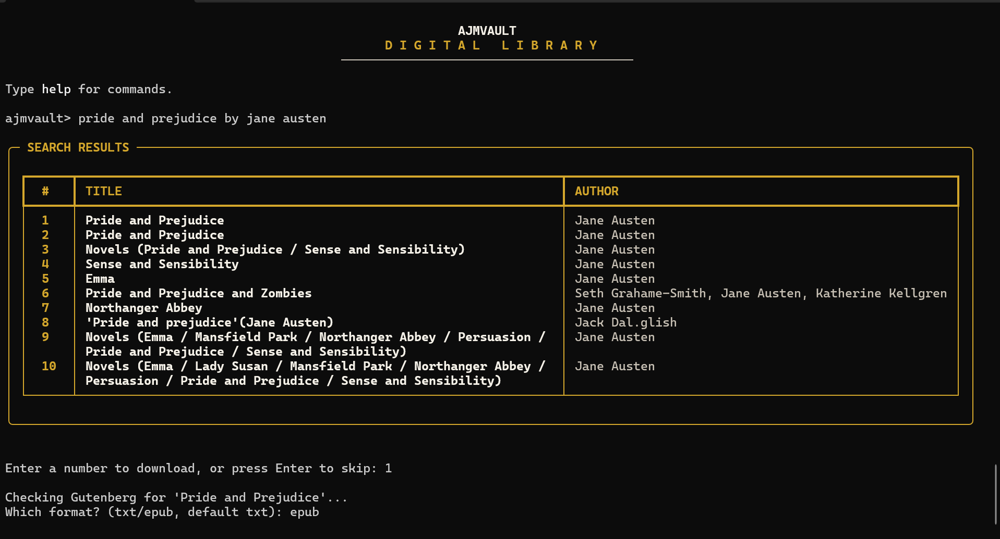
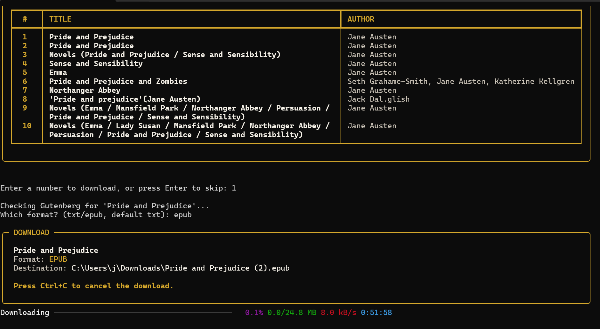

# AJMVAULT

A command-line tool for searching and downloading public domain books. Search runs against Open Library's huge catalog, but every download is verified against Project Gutenberg first — so what you get is always a real, free, legal copy. No accounts, no borrowing, no DRM.



## What it does

Type a title (throw in an author if you've got one), pick a result from the list, choose a format, and it downloads — streamed with a live progress bar, saved with a clean filename, wherever you've told it to save things.



## Why it works this way

Open Library indexes basically everything, but most of that "everything" isn't actually downloadable — it's borrow-only, or just metadata with no file behind it at all. I didn't want an app that shows you 30 results and then fails on 25 of them.

So AJMVAULT treats Open Library purely as a search index. Once you pick a book, it checks Project Gutenberg separately — matching on title *and* author, not just title, so it doesn't confidently hand you the wrong book with the same name. If Gutenberg doesn't have it, you're told that directly instead of getting a broken or mismatched file.

## Features

- Search a large catalog, download only from a source that's actually free and legal
- Pick `.txt` or `.epub`, whichever the book has available
- Live download progress, and `Ctrl+C` cancels cleanly — no half-downloaded files left behind
- Filenames get sanitized and auto-numbered if you download the same book twice
- Set your download folder with a real folder picker, or just type a path
- Remembers your folder between sessions
- Installed as a proper command (`ajmvault`), not something you run with `python main.py`

## Installation

```bash
git clone https://github.com/ajirobap0828-eng/ajmvault.git
cd ajmvault
pip install -e .
```

Then just run:

```bash
ajmvault
```

Needs Python 3.9+. `requests` and `rich` install automatically as dependencies.

## Usage

ajmvault> <title> search by title
ajmvault> <title> by <author> author helps narrow results
ajmvault> path change your download folder
ajmvault> help see all commands
ajmvault> quit exit


## How it's put together

src/ajmvault/
├── main.py # the CLI loop — search, pick, format, download
├── parse_book.py # cleans up Gutenberg's and Open Library's different JSON shapes
└── ui.py # colors, banner, styling


Gutenberg and Open Library return data in completely different shapes. `parse_book.py` normalizes both into one format so the rest of the app never has to care which source a book came from.

## What's next

Better error messages for edge cases, and I've been sketching a mobile version in Figma — no code yet, just figuring out what it'd look like.

---

Built by [Ajiroba Pelumi Marvellous](https://github.com/ajirobap0828-eng) — Software Engineering student, Babcock University.